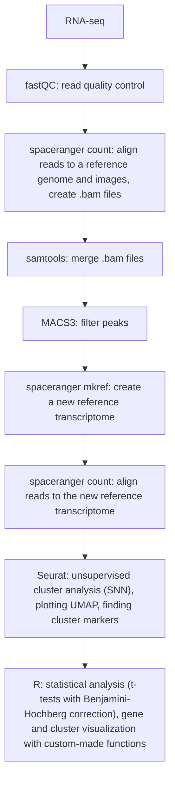

# tif-ldopa-slides

<h2>Description of the project</h2>
This GitHub repository cointains code used for the analysis of data and information about the project aimed at deciphering L-DOPA-induced changes in gene expression in the forebrain of dopamine-depleted mice (a model of Parkinson's disease), using spatial transcriptomics.  

Spatial transcriptomics method: 10xGenomics' Visium  
Model organism: Mus musculus, TIF-IADATCreERT2 strain  

BioProject ID: [PRJNA1080215](https://www.ncbi.nlm.nih.gov/bioproject/1080215)  
Project funded by the National Science Centre in Poland: [Spatial analysis of the effects of L-DOPA on gene expression in the prefrontal cortex in a mouse model of Parkinson's disease, ID: 2020/37/N/NZ4/03672](https://projekty.ncn.gov.pl/en/index.php?projekt_id=485392)  

A corresponding GitHub repository with code used for behavioral data analyses can be found [here](https://github.com/annaradli/tif-ldopa-phenotype).
Once published, the link to full-text paper will be available [here].

### Table of contents

1. [Samples summary](#samples-summary) 
2. [Analysis overview](#analysis-overview)
3. [Code and resources overview](#code-and-resources-overview)
4. [fastQC analysis results](#fastQC-analysis-results)
5. [fastq files renaming](#fastq-files-renaming-for-the-use-with-spaceranger)
6. [Software](#software)

### Samples summary

|Library ID| Visium Slide Area ID | Mouse ID | Group | Cohort| Double TT Index Well ID|Name Prefix|Slide no.|Slide ID|
|---------| -------------------- | -------- | ------| -------|---------------|------------|---------|--------|
|1| A1                   | 1-1      | mutant saline |1| A3 | S5023Nr1|1|V11A27-406|
|2|B1| 2-2 | mutant L-DOPA |1| B3| S5023Nr2|1|V11A27-406|
|3|C1| 3-2 | mutant L-DOPA  |1| C3|S5023Nr3|1|V11A27-406|
|4|D1| 3-4 | mutant saline |1| D3 |S5023Nr4|1|V11A27-406|
|5|A1|5-1|mutant saline |1|A4|S5295Nr1|2|V11A27-285|
|6|B1|5-3|mutant L-DOPA but control phenotype! (excluded from t-tests)|1|B4|S5295Nr2|2|V11A27-285|
|7|C1|6-1|mutant L-DOPA|2|C4|S5295Nr3|2|V11A27-285|
|8|D1|6-2|control saline (not used in t-tests)|2|D4|S5295Nr4|2|V11A27-285|
|9|A1|11-1|control saline (not used in t-tests) |2|A5|S5295Nr5|3|V11U14-024|
|10|B1|10-3|mutant saline|2|B5|S5295Nr6|3|V11U14-024|
|11|C1|11-3|mutant saline|2|C5|S5295Nr7|3|V11U14-024|
|12|D1|11-2|mutant L-DOPA|2|D5|S5295Nr8|3|V11U14-024|

### Analysis overview

### Code and resources overview
(TODO)
1. [fastQC reads quality check]
2. [spaceranger count]
3. [merging .bam files with samtools]
4. [filtering peaks with MACS3]
5. [creating a new reference transcriptome from the filtered peaks with spaceranger mkref]
6. [unsupervised clustering with Seurat and plotting UMAP]
7. [finding cluster markers with Seurat]
8. [defining functions for on-section gene expression visualization]
9. [visualization of the results on the sections]
10. [statistical analyses]
11. [data wrangling] for [heatmap visualization]
12. [SeuratObject with assigned clusters]
13. [.RData used for (11.)]

### fastQC analysis results
|Library ID|Filename|Sequence type|FastQC failed parameters|
|---|---|---|---|
|1|S5023Nr1.1|Read 1|Sequence Duplication Levels|
|1|S5023Nr1.2|Read 2|Sequence Duplication Levels, Per sequence GC content, Overrepresented sequences|
|2|S5023Nr2.1|Read 1|Sequence Duplication Levels|
|2|S5023Nr2.2|Read 2|Sequence Duplication Levels, Per sequence GC content|
|3|S5023Nr3.1|Read 1|Sequence Duplication Levels|
|3|S5023Nr3.2|Read 2|Sequence Duplication Levels, Per sequence GC content, Overrepresented sequences, Per base sequence content|
|4|S5023Nr4.1|Read 1|Sequence Duplication Levels|
|4|S5023Nr4.2|Read 2|Sequence Duplication Levels, Per sequence GC content, Overrepresented sequences|
|5|S5295Nr1.1|Read 1|Sequence Duplication Levels|
|5|S5295Nr1.2|Read 2|Sequence Duplication Levels, Per sequence GC content, Overrepresented sequences|
|6|S5295Nr2.1|Read 1|Sequence Duplication Levels, Per sequence GC content|
|6|S5295Nr2.2|Read 2|Sequence Duplication Levels, Per sequence GC content, Overrepresented sequences|
|7|S5295Nr3.1|Read 1|Sequence Duplication Levels, Per sequence GC content|
|7|S5295Nr3.2|Read 2|Sequence Duplication Levels, Per sequence GC content|
|8|S5295Nr4.1|Read 1|Sequence Duplication Levels, Per sequence GC content|
|8|S5295Nr4.2|Read 2|Sequence Duplication Levels, Per sequence GC content|
|9|S5295Nr5.1|Read 1|Sequence Duplication Levels|
|9|S5295Nr5.2|Read 2|Sequence Duplication Levels, Per sequence GC content, Overrepresented sequences|
|10|S5295Nr6.1|Read 1|Sequence Duplication Levels|
|10|S5295Nr6.2|Read 2|Sequence Duplication Levels, Per sequence GC content|
|11|S5295Nr7.1|Read 1|Sequence Duplication Levels|
|11|S5295Nr7.2|Read 2|Sequence Duplication Levels, Per sequence GC content, Overrepresented sequences|
|12|S5295Nr8.1|Read 1|Sequence Duplication Levels|
|12|S5295Nr8.2|Read 2|Sequence Duplication Levels, Per sequence GC content|

### fastq files renaming for the use with spaceranger
Renamed the fastq files in the following (Illumina) [convention](https://support.illumina.com/help/BaseSpace_OLH_009008/Content/Source/Informatics/BS/NamingConvention_FASTQ-files-swBS.htm): 
 
(First RNA-seq batch):  
S5023Nr1.1.fastq.gz => S5023Nr1_S1_L001_R1_001.fastq.gz  
S5023Nr1.2.fastq.gz => S5023Nr1_S1_L001_R2_001.fastq.gz  
S5023Nr2.2.fastq.gz => S5023Nr2_S2_L001_R2_001.fastq.gz  
S5023Nr2.1.fastq.gz => S5023Nr2_S2_L001_R1_001.fastq.gz  
S5023Nr3.1.fastq.gz => S5023Nr3_S3_L001_R1_001.fastq.gz  
S5023Nr3.2.fastq.gz => S5023Nr3_S3_L001_R2_001.fastq.gz  
S5023Nr4.2.fastq.gz => S5023Nr4_S4_L001_R2_001.fastq.gz  
S5023Nr4.1.fastq.gz => S5023Nr4_S4_L001_R1_001.fastq.gz  
 
(Second RNA-seq batch):  
S5295Nr1.1.fastq.gz => S5295Nr1_S1_L001_R1_001.fastq.gz  
S5295Nr1.2.fastq.gz => S5295Nr1_S1_L001_R2_001.fastq.gz  
S5295Nr2.1.fastq.gz => S5295Nr2_S2_L001_R1_001.fastq.gz  
S5295Nr2.2.fastq.gz => S5295Nr2_S2_L001_R2_001.fastq.gz  
S5295Nr3.1.fastq.gz	=> S5295Nr3_S3_L001_R1_001.fastq.gz	 
S5295Nr3.2.fastq.gz	=> S5295Nr3_S3_L001_R2_001.fastq.gz  
S5295Nr4.1.fastq.gz => S5295Nr4_S4_L001_R1_001.fastq.gz  
S5295Nr4.2.fastq.gz => S5295Nr4_S4_L001_R2_001.fastq.gz  
S5295Nr5.1.fastq.gz => S5295Nr5_S5_L001_R1_001.fastq.gz  
S5295Nr5.2.fastq.gz => S5295Nr5_S5_L001_R2_001.fastq.gz  
S5295Nr6.1.fastq.gz => S5295Nr6_S6_L001_R1_001.fastq.gz  
S5295Nr6.2.fastq.gz	=> S5295Nr6_S6_L001_R2_001.fastq.gz  
S5295Nr7.1.fastq.gz => S5295Nr7_S7_L001_R1_001.fastq.gz  
S5295Nr7.2.fastq.gz => S5295Nr7_S7_L001_R2_001.fastq.gz  
S5295Nr8.1.fastq.gz => S5295Nr8_S8_L001_R1_001.fastq.gz  
S5295Nr8.2.fastq.gz => S5295Nr8_S8_L001_R2_001.fastq.gz  

### Software 
* spaceranger v1.3.1
* mouse genome mm10 Reference - 2020-A (GENCODE vM23/Ensembl 98)
* fastQC v0.11.8
* md5sum v8.28
* Loupe Browser v6.0
* Seurat v4
* MACS3
